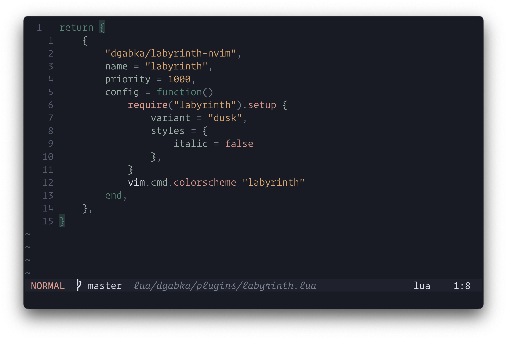
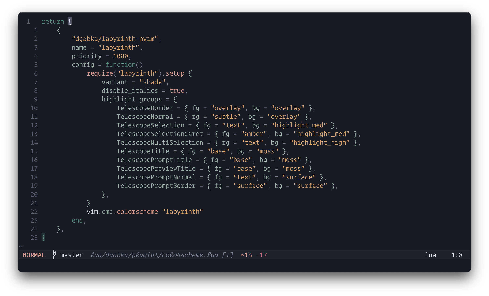

# Labyrinth

Discover Labyrinth, a serene color scheme inspired by hidden pathways and mossy landscapes. Let its gentle tones guide your creativity with calm elegance.

## Getting started

Install `dgabka/labyrinth-nvim` using your favourite plugin manager:

**paq-nvim**

```lua
{ "dgabka/labyrinth-nvim", as = "labyrinth" }
```

**lazy.nvim**

```lua
{ "dgabka/labyrinth-nvim", name = "labyrinth" }
```

## Gallery

**Labyrinth Dusk**



**Labyrinth Shade**



## Options

> [!IMPORTANT]
> Configure options _before_ setting colorscheme.

Labyrinth has two variants: dusk and shade. By default, `vim.o.background` is followed, using dawn when light and `dark_variant` when dark.

```lua
require("labyrinth").setup({
    variant = "auto", -- auto, dusk or shade
    dark_variant = "dusk", -- dusk or shade
    dim_inactive_windows = false,
    extend_background_behind_borders = true,

    enable = {
        terminal = true,
        legacy_highlights = true, -- Improve compatibility for previous versions of Neovim
        migrations = true, -- Handle deprecated options automatically
    },

    styles = {
        bold = true,
        italic = true,
        transparency = false,
    },

    groups = {
        border = "muted",
        link = "haze",
        panel = "surface",

        error = "crimson",
        hint = "haze",
        info = "leaf",
        note = "moss",
        todo = "amber",
        warn = "sun",

        git_add = "leaf",
        git_change = "amber",
        git_delete = "crimson",
        git_dirty = "amber",
        git_ignore = "muted",
        git_merge = "haze",
        git_rename = "moss",
        git_stage = "haze",
        git_text = "amber",
        git_untracked = "subtle",

        h1 = "haze",
        h2 = "leaf",
        h3 = "amber",
        h4 = "sun",
        h5 = "moss",
        h6 = "leaf",
    },

    highlight_groups = {
        -- Comment = { fg = "leaf" },
        -- VertSplit = { fg = "muted", bg = "muted" },
    },

    before_highlight = function(group, highlight, palette)
        -- Disable all undercurls
        -- if highlight.undercurl then
        --     highlight.undercurl = false
        -- end
        --
        -- Change palette colour
        -- if highlight.fg == palette.moss then
        --     highlight.fg = palette.leaf
        -- end
    end,
})

vim.cmd("colorscheme labyrinth")
-- vim.cmd("colorscheme labyrinth-shade")
-- vim.cmd("colorscheme labyrinth-dusk")
```
