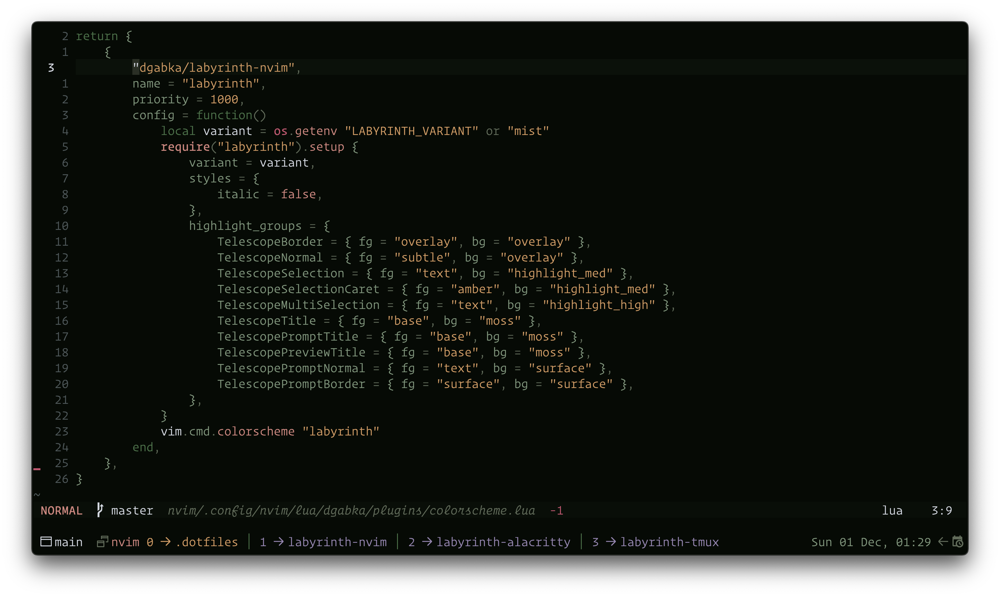
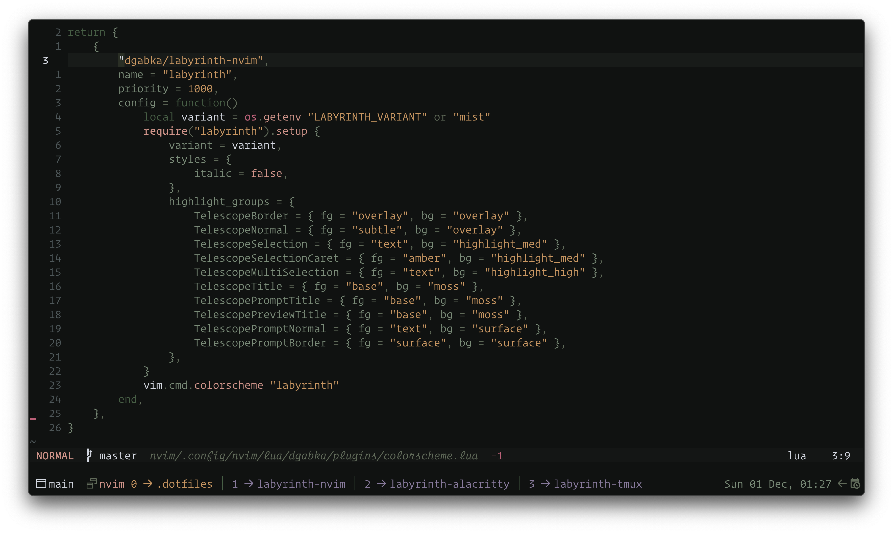

# 🌿 Labyrinth

Discover Labyrinth, a serene color scheme inspired by hidden pathways and mossy landscapes. Let its gentle tones guide your creativity with calm elegance.

Labyrinth provides four distinct variants with varying levels of contrast and color vibrancy to suit your preferences:

 - Dusk: The most contrasty variant, perfect for those who prefer sharp distinctions and vibrant colors.
 - Shade: A balanced variant, offering a comfortable middle ground with moderate contrast and vibrancy.
 - Gloom: A softer variant with reduced contrast, ideal for a more subdued and relaxed visual experience.
 - Mist: The least contrasty variant, featuring the most gentle and subtle tones for a calm and unobtrusive interface.

Whether you're coding, designing, or simply exploring new aesthetics, Labyrinth adapts to your needs with its harmonious palette.

## Getting started

Install `dgabka/labyrinth-nvim` using your favourite plugin manager:

**lazy.nvim**

```lua
{
    "dgabka/labyrinth-nvim",
    name = "labyrinth",
    priority = 1000,
    config = function()
        require("labyrinth").setup {
            variant = "shade", -- or gloom or dusk or mist
        }
        vim.cmd.colorscheme "labyrinth"
    end,
}
```

## Gallery

**Labyrinth Gloom**



**Labyrinth Dusk**



**Labyrinth Shade**


**Labyrinth Mist**


## Options

> [!IMPORTANT]
> Configure options _before_ setting colorscheme.

Labyrinth has four variants: gloom, dusk, shade and mist. Defaults to dusk.

```lua
require("labyrinth").setup({
    variant = "dusk", -- gloom, dusk, shade or mist - defaults to dusk
    dim_inactive_windows = false,
    extend_background_behind_borders = true,

    enable = {
        terminal = true,
        legacy_highlights = true, -- Improve compatibility for previous versions of Neovim
        migrations = true, -- Handle deprecated options automatically
    },

    styles = {
        bold = true,
        italic = true,
        transparency = false,
    },

    groups = {
        border = "muted",
        link = "haze",
        panel = "surface",

        error = "crimson",
        hint = "haze",
        info = "leaf",
        note = "moss",
        todo = "amber",
        warn = "sun",

        git_add = "leaf",
        git_change = "amber",
        git_delete = "crimson",
        git_dirty = "amber",
        git_ignore = "muted",
        git_merge = "haze",
        git_rename = "moss",
        git_stage = "haze",
        git_text = "amber",
        git_untracked = "subtle",

        h1 = "haze",
        h2 = "leaf",
        h3 = "amber",
        h4 = "sun",
        h5 = "moss",
        h6 = "leaf",
    },

    highlight_groups = {
        -- Comment = { fg = "leaf" },
        -- VertSplit = { fg = "muted", bg = "muted" },
    },

    before_highlight = function(group, highlight, palette)
        -- Disable all undercurls
        -- if highlight.undercurl then
        --     highlight.undercurl = false
        -- end
        --
        -- Change palette colour
        -- if highlight.fg == palette.moss then
        --     highlight.fg = palette.leaf
        -- end
    end,
})

vim.cmd("colorscheme labyrinth")
```

### Credits

Thanks to the [Rosé Pine](https://github.com/rose-pine) creators!
A special thanks to [Rosé Pine for Neovim](https://github.com/rose-pine/neovim) which this theme is based on.
